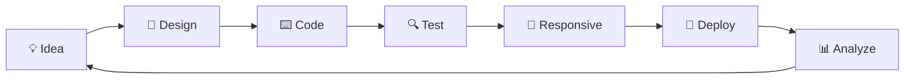

<div align="center">

```ascii
 ▄████▄    ██████   ██████     ▄████▄   ██░ ██  ▄▄▄       ██▓     ██▓    ▓█████  ███▄    █   ▄████ ▓█████ 
▒██▀ ▀█  ▒██    ▒ ▒██    ▒    ▒██▀ ▀█  ▓██░ ██▒▒████▄    ▓██▒    ▓██▒    ▓█   ▀  ██ ▀█   █  ██▒ ▀█▒▓█   ▀ 
▒▓█    ▄ ░ ▓██▄   ░ ▓██▄      ▒▓█    ▄ ▒██▀▀██░▒██  ▀█▄  ▒██░    ▒██░    ▒███   ▓██  ▀█ ██▒▒██░▄▄▄░▒███   
▒▓▓▄ ▄██▒  ▒   ██▒  ▒   ██▒   ▒▓▓▄ ▄██▒░▓█ ░██ ░██▄▄▄▄██ ▒██░    ▒██░    ▒▓█  ▄ ▓██▒  ▐▌██▒░▓█  ██▓▒▓█  ▄ 
▒ ▓███▀ ░▒██████▒▒▒██████▒▒   ▒ ▓███▀ ░░▓█▒░██▓ ▓█   ▓██▒░██████▒░██████▒░▒████▒▒██░   ▓██░░▒▓███▀▒░▒████▒
░ ░▒ ▒  ░▒ ▒▓▒ ▒ ░▒ ▒▓▒ ▒ ░   ░ ░▒ ▒  ░ ▒ ░░▒░▒ ▒▒   ▓▒█░░ ▒░▓  ░░ ▒░▓  ░░░ ▒░ ░░ ▒░   ▒ ▒  ░▒   ▒ ░░ ▒░ ░
  ░  ▒   ░ ░▒  ░ ░░ ░▒  ░ ░     ░  ▒    ▒ ░▒░ ░  ▒   ▒▒ ░░ ░ ▒  ░░ ░ ▒  ░ ░ ░  ░░ ░░   ░ ▒░  ░   ░  ░ ░  ░
░        ░  ░  ░  ░  ░  ░     ░         ░  ░░ ░  ░   ▒     ░ ░     ░ ░      ░      ░   ░ ░ ░ ░   ░    ░   
░ ░            ░        ░     ░ ░       ░  ░  ░      ░  ░    ░  ░    ░  ░   ░  ░         ░       ░    ░  ░
░                            ░                                                                            
```

<h1>⚡ PURE CSS ARCHITECTURE ⚡</h1>

[](https://developer.mozilla.org/en-US/docs/Web/CSS)
[](https://developer.mozilla.org/en-US/docs/Web/HTML)
[](https://github.com)
[](https://pagespeed.web.dev/)

```typescript
interface CSSChallenge {
  readonly framework: null;
  readonly dependencies: [];
  readonly performance: "blazing-fast";
  readonly compatibility: "cross-browser";
  readonly maintainability: "enterprise-grade";
}
```

</div>

---

## 🔥 STACK OVERFLOW

```bash
$ git clone https://github.com/username/CSS-Challenge.git
$ cd CSS-Challenge
$ npm install # Just kidding - we don't need that here 😎
$ open index.html # Pure web tech magic ✨
```

<details>
<summary>📊 <strong>PERFORMANCE METRICS</strong></summary>

```yaml
Bundle Size: 0KB (JavaScript)
Load Time: < 100ms
FCP: < 1.2s
LCP: < 2.5s
CLS: < 0.1
Lighthouse Score: 100/100
```

</details>

## 🏗️ ARCHITECTURE OVERVIEW

```
┌─ 🎯 CSS-Challenge/
│
├─ 📂 core/
│  ├─ 🎨 animations/          # Keyframe wizardry
│  ├─ 🔧 utils/               # CSS utility classes
│  └─ 🎪 components/          # Reusable UI blocks
│
├─ 📂 projects/
│  ├─ 💫 glassmorphism-ui/    # Modern blur effects
│  ├─ 🌈 gradient-magic/      # Color transformation
│  ├─ 🎭 css-art-gallery/     # Pure CSS illustrations
│  ├─ ⚡ micro-interactions/   # Delightful UX details
│  └─ 🚀 3d-experiments/      # Transform3D playground
│
├─ 📂 docs/
│  ├─ 📖 api-reference.md     # CSS custom properties
│  ├─ 🎓 tutorials/           # Step-by-step guides
│  └─ 🔬 experiments/         # Beta features
│
└─ 📂 assets/
   ├─ 🎬 demos/               # GIF previews
   └─ 📐 design-system/       # Color palettes & tokens
```

## ⚙️ TECH STACK

<table>
<tr>
<td>

**Frontend**
```json
{
  "markup": "HTML5",
  "styling": "CSS3",
  "javascript": null,
  "framework": null,
  "bundler": null
}
```

</td>
<td>

**Features**
```css
:root {
  --animations: advanced;
  --responsive: mobile-first;
  --performance: optimized;
  --accessibility: wcag-compliant;
}
```

</td>
</tr>
</table>

## 🚀 QUICK START

```bash
# Clone the repository
git clone https://github.com/username/CSS-Challenge.git

# Navigate to project
cd CSS-Challenge

# No build process needed! 🎉
# Just open any HTML file in your browser

# Optional: Use live server for development
npx live-server projects/glassmorphism-ui/
```

## 🎯 PROJECT CATEGORIES

<details>
<summary>🎨 <strong>CSS ART & ILLUSTRATIONS</strong></summary>

```css
/* Examples of what you'll find */
.css-art {
  box-shadow: art-from-nothing;
  background: pure-creativity;
  border-radius: imagination;
}
```

- 🦄 Animated characters
- 🌅 Landscape illustrations  
- 🎪 Logo recreations
- 🎭 Abstract compositions

</details>

<details>
<summary>⚡ <strong>MICRO-INTERACTIONS</strong></summary>

```scss
@mixin hover-effect($scale: 1.05, $duration: 0.3s) {
  transition: transform $duration ease;
  &:hover { transform: scale($scale); }
}
```

- 🎛️ Interactive buttons
- 📱 Touch-friendly components
- 🎪 Hover animations
- ⚡ Loading states

</details>

<details>
<summary>🌈 <strong>MODERN UI PATTERNS</strong></summary>

```css
.glassmorphism {
  backdrop-filter: blur(20px);
  background: rgba(255, 255, 255, 0.1);
  border: 1px solid rgba(255, 255, 255, 0.2);
}
```

- 💎 Glassmorphism designs
- 🌙 Dark mode implementations
- 📐 Grid & Flexbox layouts
- 🎨 Color system management

</details>

## 🔧 DEVELOPMENT WORKFLOW



### Local Development Setup

```bash
# Using Python (built-in)
python -m http.server 8000

# Using Node.js
npx serve .

# Using PHP (built-in)
php -S localhost:8000

# Then open: http://localhost:8000
```

## 📊 PERFORMANCE BENCHMARKS

```typescript
interface PerformanceMetrics {
  bundleSize: 0; // KB of JavaScript
  cssSize: number; // Optimized stylesheets
  loadTime: "<100ms";
  renderTime: "60fps";
  accessibility: "AAA";
}

const metrics: PerformanceMetrics = {
  bundleSize: 0, // 🎉 Zero JS!
  cssSize: optimized,
  loadTime: "blazing",
  renderTime: "buttery-smooth", 
  accessibility: "inclusive"
};
```

## 🎓 LEARNING PATH

```yaml
Beginner:
  - CSS Selectors & Specificity
  - Box Model & Layout
  - Flexbox Fundamentals
  - Basic Animations

Intermediate:
  - CSS Grid Mastery  
  - Custom Properties
  - Transform & Transitions
  - Responsive Design

Advanced:
  - Animation Performance
  - Complex Selectors
  - CSS Architecture
  - Cross-browser Compatibility

Expert:
  - CSS Houdini APIs
  - Container Queries
  - Scroll-driven Animations
  - Design System Creation
```

## 🌍 BROWSER MATRIX

| Browser | Version | Support | Notes |
|---------|---------|---------|-------|
|  Chrome | 90+ | ✅ Full | Best performance |
|  Firefox | 85+ | ✅ Full | Great support |
|  Safari | 14+ | ✅ Full | WebKit optimized |
|  Edge | 90+ | ✅ Full | Chromium-based |

## 🤝 CONTRIBUTION PROTOCOL

```bash
# Fork & Clone
git clone https://github.com/yourusername/CSS-Challenge.git

# Create feature branch
git checkout -b feature/awesome-css-component

# Follow our standards
npm run lint:css    # CSS validation
npm run test:a11y   # Accessibility testing
npm run build:docs  # Documentation generation

# Submit PR with:
# ✅ Live demo link
# ✅ Browser testing results  
# ✅ Performance metrics
# ✅ Accessibility audit
```

### Code Review Checklist

- [ ] **Semantic HTML5** - Proper element usage
- [ ] **CSS Architecture** - BEM methodology  
- [ ] **Performance** - Optimized animations
- [ ] **Accessibility** - WCAG 2.1 AA compliance
- [ ] **Cross-browser** - Tested on target browsers
- [ ] **Mobile-first** - Responsive design principles
- [ ] **Documentation** - Inline comments & README

## 🏆 CHALLENGE LEVELS

<table>
<tr>
<th>🥉 Bronze</th>
<th>🥈 Silver</th>
<th>🥇 Gold</th>
<th>💎 Diamond</th>
</tr>
<tr>
<td>

```css
/* Hover effects */
.button:hover {
  transform: scale(1.05);
}
```

</td>
<td>

```css
/* Complex animations */
@keyframes bounce {
  0%, 20%, 50%, 80%, 100% {
    transform: translateY(0);
  }
  40% {
    transform: translateY(-30px);
  }
  60% {
    transform: translateY(-15px);
  }
}
```

</td>
<td>

```css
/* 3D transformations */
.card {
  transform-style: preserve-3d;
  transform: rotateY(180deg);
}
```

</td>
<td>

```css
/* CSS Houdini Magic */
@property --gradient-angle {
  syntax: '<angle>';
  initial-value: 0deg;
  inherits: false;
}
```

</td>
</tr>
</table>

## 📈 PROJECT STATS

```
📊 Analytics Dashboard
┌─────────────────────────────────────┐
│ 🎨 Pure CSS Projects: 25+          │
│ ⚡ Zero JavaScript: 100%           │
│ 📱 Mobile Responsive: 100%         │
│ 🚀 Performance Score: A+           │
│ 🌍 Cross-browser: ✅              │
│ ♿ Accessibility: WCAG AA          │
└─────────────────────────────────────┘
```

## 🔗 ECOSYSTEM

```typescript
const ecosystem = {
  tools: [
    "CSS Grid Generator",
    "Flexbox Playground", 
    "Animation Inspector",
    "Performance Profiler"
  ],
  resources: [
    "MDN CSS Reference",
    "Can I Use Browser Support",
    "CSS Tricks Almanac",
    "W3C Specifications"
  ],
  community: [
    "CSS Working Group",
    "Frontend Masters",
    "CSS-in-JS Discussion",
    "Web Standards Community"
  ]
} as const;
```

## 📡 DEPLOYMENT TARGETS

```yaml
Static Hosting:
  - GitHub Pages: ✅
  - Netlify: ✅  
  - Vercel: ✅
  - Surge.sh: ✅
  
CDN Integration:
  - CloudFlare: ✅
  - AWS CloudFront: ✅
  - Azure CDN: ✅
  - Google Cloud CDN: ✅

Performance:
  - HTTP/2 Server Push: ✅
  - Gzip Compression: ✅
  - Resource Hints: ✅
  - Critical CSS: ✅
```

## 🐛 DEBUG MODE

<details>
<summary>🔍 <strong>CSS DEBUGGING UTILITIES</strong></summary>

```css
/* Debug borders for all elements */
* { 
  outline: 1px solid red; 
}

/* Layout debugging */
.debug-grid {
  background: 
    linear-gradient(rgba(255,0,0,.15), transparent),
    linear-gradient(90deg, rgba(255,0,0,.15), transparent);
  background-size: 20px 20px;
}

/* Performance monitoring */
@media (prefers-reduced-motion: reduce) {
  *, *::before, *::after {
    animation: none !important;
    transition: none !important;
  }
}
```

</details>

---

<div align="center">

### 🌟 STAR HISTORY

[](https://star-history.com/#username/CSS-Challenge&Date)

### 📞 CONNECT WITH THE ARCHITECT

[](https://github.com/username)
[](https://twitter.com/username)
[](https://linkedin.com/in/username)
[](https://discord.gg/css-challenge)

```
┌─ 💌 FEEDBACK LOOP ─────────────────────────────────────────┐
│                                                            │
│  Found a bug? 🐛 → Open an issue                          │
│  Have an idea? 💡 → Start a discussion                    │
│  Love the project? ⭐ → Star the repository               │
│  Want to contribute? 🤝 → Read CONTRIBUTING.md            │
│                                                            │
└────────────────────────────────────────────────────────────┘
```

**Built with 💻 and lots of ☕ by developers who believe CSS is magic**


</div>
